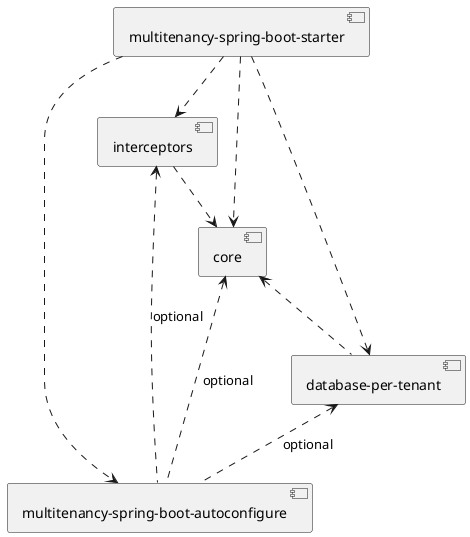
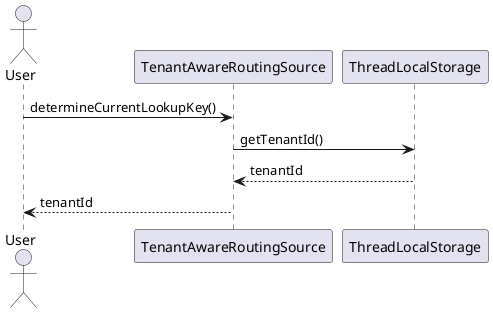
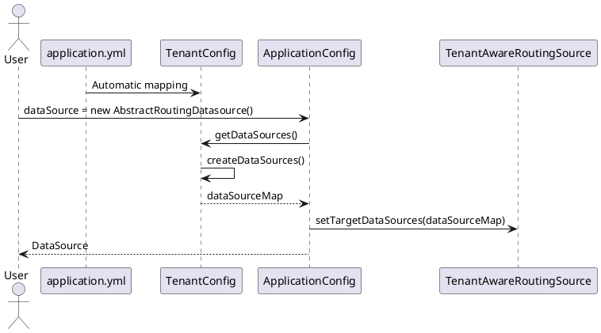

# Technical Specifications
## Design
### multi module
The project is subject to a multi module architecture.
The below diagram describes the modules and their dependencies to each other.

## Program Flow
### Interceptor
The TenantIdInterceptors PreHandle method executes logic before the request is handled. 
So before anything happens the tenantId is retrieved from the request and is set in the ThreadLocalStorage.
ThreadLocal is used so that the context is bound to the currently executing thread.
After the request is completed the tenantId is erased from the thread because Spring may reuse the thread in the thread pool,
and you don't want to leak this information.

### AbstractRoutingDataSource
During the handling of the request the AbstractRoutingDataSource returns the appropriate DataSource to utilize, using the tenantId stored in the ThreadLocalStorage.

### Tenant data source configuration
A developer using this project is able to set multiple data sources using the application.yml file as described in the README.
The data sources defined in the application.yml file are mapped to the TenantConfig class using the @Configuration and @ConfigurationProperties annotations.
TenantConfig contains logic to create and return actual DataSource objects based the String input from the application.yml file.
 
In the ApplicationConfig class a DataSource Bean is defined. This DataSource contains all the user defined data sources in a Map.
Spring framework automatically uses it for database operations.
