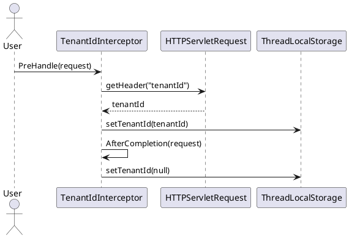
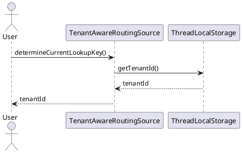

# Tenchincal Specifications
## Sequence diagram
The TenantIdInterceptors PreHandle method executes logic before the request is handled. So before anything happens the tenantId is retrieved from the request and is set in the ThreadLocalStorage. ThreadLocal is used so that the context is bound to the currently executing thread.
After the request is completed the tenantId is erased from the Thread because Spring may reuse the Thread in the Thread Pool and you don't want to leak this information.

During the handling of the request the AbstractRoutingDataSource returns the appropriate DataSource to utilize, using the tenantId stored in the ThreadLocalStorage.

